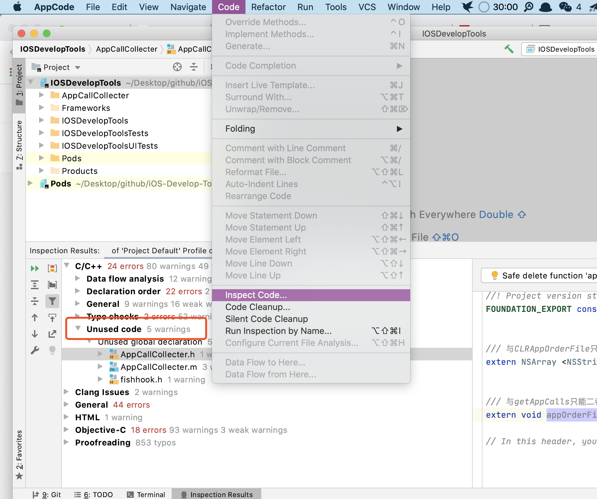
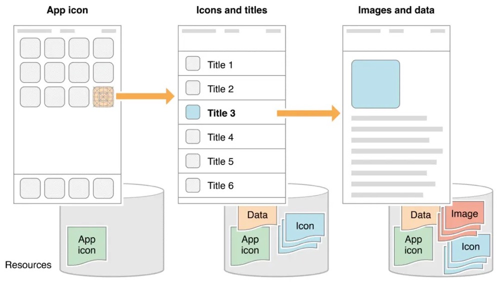
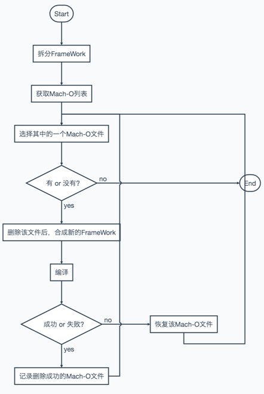

## 背景

为什么要进行包大小优化？

虽然苹果官方一直在提高最大的可执行文件大小，在 iOS 13 还取消了强制的 OTA 限制，但是超过 200 MB 会默认请求用户下载许可（可在 设置 - iTunes Store与App Store - App下载 中配置），并且iOS 13 以下的超过 200 MB 无法使用 OTA，影响了整体更新率。

如果 App 还要适配 iOS 8 之前的版本，苹果还规定了主二进制 __TEXT 段的大小不能超过 60MB，否则上传构建时会被打回。

为了更好的用户体验，减少用户等待时间，包瘦身仍然是 App 优化中重要的一环。


## 资源瘦身

### 移除无用图片资源

- 目前市面上基本不适配 iPhone4 以下的机型了，1x 的图片都可以移除。

- 通过资源关键字进行全局匹配，筛选出未使用的资源。有些资源使用是通过拼接或者后台下发名称，需对筛选出的资源进行筛选，防止误删。

- 这里推荐使用工具 [LSUnusedResources](https://github.com/tinymind/LSUnusedResources)，可以根据项目实际情况定义查找文件的正则表达式。另外建议勾选 Ignore similar name ，避免扫描出图片组。

  

  

### 压缩图片等资源文件

- 建议使用无损压缩，例如 [ImageOptim](https://imageoptim.com/mac)、[pngquant命令](https://pngquant.org)、[tinypng](https://tinypng.com/) ，如果涉及有损压缩最好要求设计介入进行资源检查。
- 还可以使用 [Webp](https://developers.google.com/speed/webp/) 格式的图片，Webp 是由 Google 推出的图片格式，有损压缩模式下图片体积只有 jpeg 格式的 1/3，无损压缩也能减小 1/4，可以使用 [cwebp](https://developers.google.com/speed/webp/docs/precompiled) 进行格式压缩转换，目前 SDWebImage、Kingfisher 都用支持该格式解析的拓展。无损压缩命令如下：

  ```
  // 语法
  cwebp [options] input_file -o output_file.webp
  // 无损压缩
  cwebp -lossless original.png -o new.webp
  ```

  除了终端命令，还可以使用 [iSparta](http://isparta.github.io/) 进行批量转换格式。

  

- Xcode 本身也提供压缩图片的编译选项

  - Compress PNG Files

    打包的时候基于 pngcrush 工具自动对图片进行无损压缩，如果我们已自行对图片进行压缩，该选项最好关闭。

  - Remove Text Medadata From PNG Files

    移除 PNG 资源的文本字符，比如图像名称、作者、版权、创作时间、注释等信息。

  


### 删除重复文件

通过校验所有资源的 MD5，筛选出项目中的重复资源，推荐使用 [fdupes](https://github.com/adrianlopezroche/fdupes) 工具进行重复文件扫描，fdupes 是 Linux 平台的一个开源工具，由 C 语言编写 ，文件比较顺序是`大小对比 > 部分 MD5 签名对比 > 完整 MD5 签名对比 > 逐字节对比`。

通过 Homebrew 安装 fdupes：

```
brew install fdupes
```

查看目标文件夹下的重复文件：

````````
fdupes -Sr 文件夹   // 查看文件夹下所有子目录中的重复文件及大小
fdupes -Sr 文件夹 > 输出地址.txt  // 将信息输出到txt文件中

````````

输出内容如下，一般情况下，相同文件仅保留一份，修改对应的引用即可。

```
4474 bytes each:
Test/Images.xcassets/TabBarImage/tabBar_2.imageset/tabBar_2@2x.png
Test/Resource/TabBarImage/tabBar_2@2x.png

3912 bytes each:
Test/Images.xcassets/TabBarImage/tabBar_3.imageset/tabBar_3@2x.png
Test/Resource/TabBarImage/tabBar_3@2x.png

```

### 图片资源放入.xcassets

- 尽量将图片资源放入 Images.xcassets 中，包括 pod 库的图片。 Images.xcassets 中的图片加载后会有缓存，提升加载速度，并且在最终打包时会自动进行压缩（Compress PNG Files），再根据最终运行设备进行 2x 和 3x 分发。

- 对于内部 Pod 库中的资源文件，我们可以在 Pod 库里面的 Resources 目录下新建 Asset Catalog 文件，命名为 Images.xcassets，移入所有图片文件，接着手动修改该 SDK 的 `podspec` 文件指定使用该 Images.xcassets。

  ```
  s.resource_bundles = {
      'xxsdk' => ['PAX/Assets/*.xcassets']
  }
  ```

  > Pod 资源文件的引用方式分为 `resource_bundles` 和 `resources`，这里我们使用的是 `resource_bundles`，会为为指定的资源打一个 `.bundle`，`.bundle`包含一个 `Assets.car`，获取图片的时候要严格指定 `bundle` 的位置，能很好的隔离各个库资源包。
  >
  > ```objective-c
  > NSString *bundlePath = [[NSBundle bundleForClass:[self class]].resourcePath stringByAppendingPathComponent:@"/PAX.bundle"];
  >         NSBundle *resource_bundle = [NSBundle bundleWithPath:bundlePath];
  >         UIImage *image = [UIImage imageNamed:@"xxxx" inBundle:resource_bundle compatibleWithTraitCollection:nil];
  > ```
  >
  > 
  >
  > - `resource_bundles`
  >
  >   允许定义当前 Pod 库的资源包的**名称和文件**。用 hash 的形式来声明，key 是 bundle 的名称，value 是需要包括的文件的通配 patterns。CocoaPods 官方强烈推荐使用 `resource_bundles`，因为用 key-value 可以避免相同名称资源的名称冲突。同时建议 bundle 的名称至少应该包括 Pod 库的名称，可以尽量减少同名冲突
  >
  > - `resources`
  >
  >   使用 `resources` 来指定资源，被指定的资源只会简单的被 copy 到目标工程中（主工程）。官方认为用 `resources` 是无法避免同名资源文件的冲突的，同时，Xcode 也不会对这些资源做优化。
  >
  > 


### 部分大资源文件通过运行下载

对于一些非必要的大资源文件，例如字体库、换肤资源，可以在 App 启动后通过异步下载到本地，而不用直接放在 ipa 包内。


## 代码瘦身

### 删除未使用代码

####  LinkMap 结合 Mach-O 

LinkMap 的 Symbols 中会列出所有方法、类、block及它们的大小，通过获取 LinkMap 即可以获得方法和类的全集；再通过 MachOView 获得使用过的方法和类，两者的差值就是我们要找寻的未使用代码。

- 获取 LinkMap 

  将 Build Setting - Write Link Map File 设置为 Yes，接着设置 Path to Link Map File 指定文件存放位置，即可在每次编译后获取对应的 LinkMap 文件。

- MachOView

  [MachOView](https://github.com/gdbinit/MachOView) 是一款开源软件，可以查看 Mach-O 文件的内容。OC 的方法都会通过 objc_msgSend 来调用。可以通过 Mach-O 查看 ``__objc_selrefs`` 这个 section 来获取 selector 参数的，另外 `__objc_classrefs` 和 `__objc_superrefs` 这两个 section 可以获取调用过的类和父类。

  

**该方式可作为参考使用，移除的代码还需要经过二次确认，防止存在拼接字符串动态等调用方式。**

#### AppCode

当工程代码量不大时，还可以使用 AppCode 自带的静态分析工具辅助检查未使用的类和代码，功能在菜单 Code - Inspect Code。



**该静态检测方式存在的问题较多，适合作为平常开发的辅助检测工具使用**。具体的问题有：

- SDK定义的未使用的协议会被判定为无用协议
- 如果子类使用了父类的方法，父类的这个方法不会被认为使用了
- 通过点的方式使用属性，该属性会被认为没有使用
- 使用 performSelector 方式调用的方法也检查不出来，比如 self performSelector:@selector(arrivalRefreshTime)
- 运行时声明类的情况检查不出来。比如通过 NSClassFromString 方式调用的类会被查出为没有使用的类，比如 layerClass = NSClassFromString(@“SMFloatLayer”)。还有以[[self class] accessToken] 这样不指定类名的方式使用的类，会被认为该类没有被使用。像 UITableView 的自定义的 Cell 使用 registerClass，这样的情况也会认为这个 Cell 没有被使用。


### 删除版本遗留代码

随着项目业务的迭代，必然会出现版本遗弃的功能，这些功能可能连入口都已经屏蔽。对于这些老业务代码，也是应该被移除的。

我们可以通过 Runtime 提供的 `isInitialized` 方法在运行时检测一个类是否有被使用过，更多代码可查看 [objc4-750](https://github.com/SimonYHB/objc4-750.git)。

```objective-c

// 类的方法列表已修复
#define RW_METHODIZED         (1<<30)

// 类已经初始化了
#define RW_INITIALIZED        (1<<29)

// 类在初始化过程中
#define RW_INITIALIZING       (1<<28)

// class_rw_t->ro 是 class_ro_t 的堆副本
#define RW_COPIED_RO          (1<<27)

// 类分配了内存，但没有注册
#define RW_CONSTRUCTING       (1<<26)

// 类分配了内存也注册了
#define RW_CONSTRUCTED        (1<<25)

// GC：class有不安全的finalize方法
#define RW_FINALIZE_ON_MAIN_THREAD (1<<24)

// 类的 +load 被调用了
#define RW_LOADED             (1<<23)

bool isInitialized() {
   return getMeta()->data()->flags & RW_INITIALIZED;
}
```

### 精简重复代码

多人开发的项目可能存在大量复制粘贴代码，可以通过 [PMD](https://pmd.github.io/) 扫描重复的代码片段，再结合实际逻辑重构代码。

**PMD** 是一个代码静态扫描工具，直接通过 `brew` 命令安装。

```
brew install pmd
```

安装完成后，通过 PMD-CPD 即可得到重复代码信息，格式如下：

```
pmd cpd --files 扫描文件目录 --minimum-tokens 70 --language objectivec --encoding UTF-8 --format xml > repeat.xml
```

其中，`--files` 用于指定文件目录，`--minimum-tokens` 用于设置最小重复代码阈值，`--format` 用于指定输出文件格式，支持 xml/csv/txt 等格式，这里建议使用 xml，方便查看 。

生成的 XML 文件内容如下，根据 file 标签信息就能定位到重复代码位置。

```xml
<?xml version="1.0" encoding="UTF-8"?>
<pmd-cpd>
   <duplication lines="87" tokens="565">
      <file column="1" endcolumn="3" endline="197" line="111"
            path="/Users/github/iOS-Develop-Tools/IOSDevelopTools/IOSDevelopTools/OCTimeConsumeMonitor/YECallMonitor.m"/>
      <file column="1" endcolumn="3" endline="152" line="66"
            path="/Users/github/iOS-Develop-Tools/IOSDevelopTools/IOSDevelopTools/OCTimeConsumeMonitor/YECallTraceShowViewController.m"/>
      <codefragment><![CDATA[}
#pragma private
- (NSUInteger)findStartDepthIndex:(NSUInteger)start arr:(NSArray *)arr
{
    NSUInteger index = start;
    if (arr.count > index) {
        YECallRecordModel *model = arr[index];
        int minDepth = model.depth;
        int minTotal = model.total;
        for (NSUInteger i = index+1; i < arr.count; i++) {
            YECallRecordModel *tmp = arr[i];
            if (tmp.depth < minDepth || (tmp.depth == minDepth && tmp.total < minTotal)) {
                minDepth = tmp.depth;
                minTotal = tmp.total;
                index = i;
            }
        }
    }
    return index;
}

- (void)setRecordDic:(NSMutableArray *)arr record:(YEThreadCallRecord *)record
{
    if ([arr isKindOfClass:NSMutableArray.class] && record) {
        int total=1;
        for (NSUInteger i = 0; i < arr.count; i++)
        {
            YECallRecordModel *model = arr[i];
            if (model.depth == record->depth) {
                total = model.total+1;
                break;
            }
        }
        
        YECallRecordModel *model = [[YECallRecordModel alloc] initWithCls:record->cls sel:record->sel time:record->time depth:record->depth total:total];
        [arr insertObject:model atIndex:0];
    }
}

]]></codefragment>
   </duplication>
</pmd-cpd>
```


## 与包体积有关的编译选项

### 建议修改

- Valid Architectures 

  设置编译生成的 ipa 包所支持的架构，不支持32位以及 iOS8 ，可去掉 armv7及之前的架构 ，减小生成的 ipa 包。

- Strip Link Product 和 *Deployment* Postprocessing

  Strip Linked Product 默认为 Yes，Deployment Postprocessing 默认为 No，Strip Linked Product 在 *Deployment* Postprocessing 设置为 YES 的时候才生效。当Strip Linked Product设为YES的时候，ipa会去除掉symbol符号，运行 App 断点不会中断，在程序中打印[NSThread callStackSymbols]也无法看到类名和方法名。而在程序崩溃时，终端的函数调用栈中也无法看到类名和方法名。但是不会影响正常的崩溃日志生成和解析，依然可以通过符号表来解析崩溃日志，适合线上使用，建议在 release 下都设置为 Yes。

- Generate Debug Symbols

  默认为 Yes，当设置为 Yes 时，编译生成的 .o 文件会更大，包含了断点信息和符号化的调试信息，方便开发阶段调试，建议在 release 下设置为 No，线上需要获取崩溃信息时搭配编译生成的 dSYM 文件解析符号。

- Enable C++ Exceptions 和 Enable Objective-C Exceptions

  默认都为 Yes，用于捕获 C++ 和 OC 的异常，建议在 release 下设置为 Yes，配合在 Other C Flags 添加 -fno-exceptions 和 -fno-rtt  

  ---------------------未完

  去掉异常支持，Enable C++ Exceptions和Enable Objective-C Exceptions设为NO，并且Other C Flags添加-fno-exceptions，可执行文件减少了27M，其中__gcc_except_tab段减少了17.3M，__text减少了9.7M，效果特别明显。可以对某些文件单独支持异常，编译选项加上-fexceptions即可。但有个问题，假如ABC三个文件，AC文件支持了异常，B不支持，如果C抛了异常，在模拟器下A还是能捕获异常不至于Crash，但真机下捕获不了（有知道原因可以在下面留言：）。去掉异常后，Appstore后续几个版本Crash率没有明显上升。个人认为关键路径支持异常处理就好，像启动时NSCoder读取setting配置文件得要支持捕获异常，等等

  

### 保持不变

- Generate Debug Symbols

  默认为 Yes，用生成dSYM文件，有助于解析崩溃信息。

- Make Strings Read-Only

  默认为 Yes，复用字符串字面量。

- Dead Code Stripping

  默认为 Yes，去除冗余代码。

- Optimization Level

  Release 下默认为 Fastest, Smalllest[-Os]，自动优化代码。

- Symbols Hidden by Default

  Release 下默认为 Yes，会移除符号信息，把所有符号都定义成 private extern。


## App Thinning

WWDC2015 发布会上首次介绍了 App Thinning，并在 iOS9 开始应用。严格来说App Thinning不会让安装包变小，但用户安装应用时，苹果会根据用户的机型自动选择合适的资源和对应CPU架构的二进制执行文件（也就是说用户本地可执行文件不会同时存在 armv7 和 arm64），减少下载流量和安装占用空间。

在上传 App 时，配置 App Thinning 即可开启。分为三个部分： Slicing、Bitcode、On-Demand Resources。


### Slicing

在向 iTunes connect 上传 App 后，会做 App 进行分割，创建不同的变体来适配不同的设备，不同变体之间的差异主要体现在系统指令集和资源文件上。

在项目的 xcassets 目录添加图片，2x 和 3x 图会分别放入到不同的变体中，用户从 App Store 下载时只下载特定的变体，而不会下载全部的指令集和资源文件。


### Bitcode 

Bitcode 是编译好的程序中间码，使用 Bitcode 上传到 iTunes Connect 的 app 将会在 Apple 服务器中进行链接和编译。该步骤主要是方便 Apple 推出新的架构或LLVM优化时无需重新上传 App。

通过设置项目的 `Build Settings -> Enable Bitcode` 为 YES 开启Bitcode，使用时需要保证 App 中所有的静态库和动态库都支持，否则会编译失败。

由于 App 的编译是在 Apple 服务器中进行的，所以本地无法获取 dSYM 文件进行崩溃分析，需在上传时勾选 `Include app symbols for your application* to receive symbolicated crash logs from Apple`，再从  `Xcode -> Window -> Organizer` 或者 Apple Store Connect 中下载对应的 dYSM文件。

### On-Demand Resources

可将部分资源单独下载，而不随着 App 一同下载，减少初始 App 的大小。例如相机的滤镜和游戏关卡。




## 其他

### Framework 瘦身

####  只保留需要的指令集

没有开启 Bitcode 时，App 内的 Framework 会包含多个指令集，我们可以手动移除不需要的指令集。

Framework 也是 Mach-O 格式文件，一般第三方的 Framework 为了适配多种架构，都会包含全部 CPU 的指令集，此时的二进制文件称谓胖二进制文件。

例如百度地图的定位框架 BMKLocationKit，就包含了所有 CPU 的指令集，我们可以通过 `lipo -info BMKLocationKit`  看到如下信息： 

```
Architectures in the fat file: /Users/BMKLocationKit.framework/BMKLocationKit are: armv7 armv7s i386 x86_64 arm64
```

k也可以使用 MachOView 工具查看：


可以看到 BMKLocationKit 包含了 `armv7 armv7s i386 x86_64 arm64` 5种指令集，而对于大多数移动端 App，只需要 armv7s 和 arm64 指令集就足够了。

不同手机型号对应的指令集如下：

| 指令集 | 型号                                                         |
| ------ | ------------------------------------------------------------ |
| armv7  | iPhone4s之前 \| iPad｜iPad2｜iPad3(The New iPad)｜iPad mini｜iPod Touch 3G |
| armv7s | iPhone5｜iPhone5C｜iPad4(iPad with Retina Display)           |
| arm64  | iPhone5s之后的机型 \| iPad Air  \| iPad mini2(iPad mini with Retina Display)等 |
| x86_64 | 模拟器64位处理器 \| Mac应用                                  |
| I386   | 模拟器32位处理器 \| Mac应用                                  |

我们可以通过 lipo 命令拆分胖二进制文件，只保留需要的指令集，以 BMKLocationKit 为例，指令如下：

```objective-c
lipo -info BMKLocationKit.framework/BMKLocationKit
// Architectures in the fat file: BMKLocationKit are: armv7 armv7s i386 x86_64 arm64
  
// 抽取armv7s架构
lipo BMKLocationKit.framework/BMKLocationKit -thin armv7s -output BMK/BMKLocationKitArmv7s
  
// 抽取arm64架构
lipo BMKLocationKit.framework/BMKLocationKit -thin arm64 -output BMK/BMKLocationKitArm64
  
// 合成armv7s和arm64
cd /Users/yehuangbin/Desktop/BMK
lipo -create BMKLocationKitArm64 BMKLocationKitArmv7s -output BMKLocationKit
  
lipo -info BMKLocationKit
// Architectures in the fat file: BMKLocationKit are: armv7s arm64

// 替换原先的二进制文件
mv -f BMKLocationKit ../BMKLocationKit.framework/
```

移除多余的指令集后，framework 大小从 4.3MB 降到 1.8MB，效果还是很显著的。

#### 移除 Framework 的未使用代码

通常我们可能因为某一个功能需求而引入较庞大的第三方 Framework，可以拆分 machO 文件，将不需要的 .o 文件移除。

由于我们不是 framework 的作者，不熟悉其代码调用逻辑，移除后应多次验证是否会有关联影响，整天流程如图所示，具体操作可查看 [删除 FrameWork 中无用 mach-O 文件](https://www.infoq.cn/article/ios-thinning-delete-unnecessary-mach-o/)。



涉及到的终端指令：

```
// 查看二进制文件的架构信息
lipo -info 二进制文件  

// 按架构拆分二进制文件，iOS常用 arm64、armv7s
lipo 二进制文件 -thin 架构 -output 新架构二进制文件

// 拆分二进制文件具体的内容(.o文件列表)
ar -x 二进制文件

// 将.o合并成二进制文件
libtool -static -o 新二进制文件 *.o

// 合并将不同架构二进制文件
lipo -create a架构二进制文件 b架构二进制文件 -output 合并后的二进制文件
```


### App Extension 用动态库替代静态库

减少了二进制文件的体积，但增加了整个包的大小，还会增加启动时间，需多方面考虑。

### 慎重引入第三方库

- 不要用引入功能重复的第三库，例如 YYModel 和 JSONModel、AFNetworking 和 MKNetworkingKt。
- 充分考虑引入的必要型，避免”因小引大“，例如只是需要 JSON 转模型功能而引入了整个 YYKit，更好的方式应该是将使用的部分抽离出来。

### H5本地资源优化（只保留主页面）

项目中有离线资源包，可考虑只保留主页面的代码和资源，通过增量更新的方式，启动后再进行其余离线包的下载。

## 总结

在实际项目瘦身过程中，上面列举的方式不一定都适用。例如当项目具有动态化，许多类和方法都不会在代码中直接产生引用，而可能是通过接口方式下发数据来使用，如果没有配置表会容易产生误删。我们应该怀着敬畏之心，宁可多花点时间，避免误操作，毕竟瘦身虽可贵，安全价更高！

### 工具汇总


### 参考资料

- [包大小：如何从资源和代码层面实现全方位瘦身？](https://time.geekbang.org/column/article/88573?utm_source=web&utm_medium=pinpaizhuanqu&utm_campaign=baidu&utm_term=pinpaizhuanqu&utm_content=0427)

- [Humble Assets Catalog](http://lingyuncxb.com/2019/04/14/HumbleAssetCatalog/)

- [iOS-APP包的瘦身之旅（从116M到现在的36M的减肥之路）_移动开发_ZFJ_张福杰-CSDN博客](https://blog.csdn.net/u014220518/article/details/79725478)

- [iOS 瘦身之道](https://juejin.im/post/5cdd27d4f265da036902bda5)

- [删除 FrameWork 中无用 mach-O 文件](https://www.infoq.cn/article/ios-thinning-delete-unnecessary-mach-o/)


https://github.com/skyming/iOS-Performance-Optimization


- [iOS微信安装包瘦身](https://mp.weixin.qq.com/s?__biz=MzAwNDY1ODY2OQ==&mid=207986417&idx=1&sn=77ea7d8e4f8ab7b59111e78c86ccfe66&scene=24&srcid=0921TTAXHGHWKqckEHTvGzoA#rd)


https://juejin.im/post/5cdd27d4f265da036902bda5#heading-17

https://www.infoq.cn/article/clang-plugin-ios-app-size-reducing/

https://mp.weixin.qq.com/s?__biz=MzAwNDY1ODY2OQ==&mid=207986417&idx=1&sn=77ea7d8e4f8ab7b59111e78c86ccfe66&scene=24&srcid=0921TTAXHGHWKqckEHTvGzoA#rd

