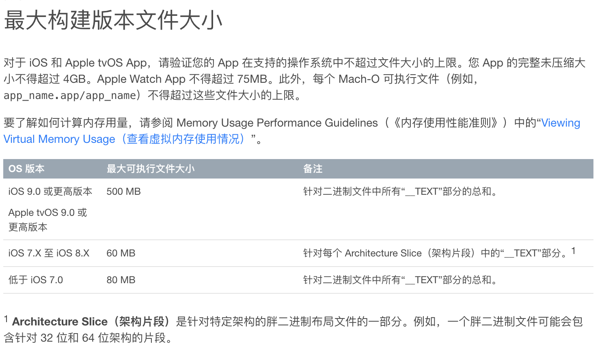

### 参考资料

[10 | 包大小：如何从资源和代码层面实现全方位瘦身？-极客时间](https://time.geekbang.org/column/article/88573?utm_source=web&utm_medium=pinpaizhuanqu&utm_campaign=baidu&utm_term=pinpaizhuanqu&utm_content=0427)

[iOS-APP包的瘦身之旅（从116M到现在的36M的减肥之路）_移动开发_ZFJ_张福杰-CSDN博客](https://blog.csdn.net/u014220518/article/details/79725478)

[iOS 瘦身之道](https://juejin.im/post/5cdd27d4f265da036902bda5)

[iOS安装包瘦身指南](http://www.zoomfeng.com/blog/ipa-size-thin.html)

[Humble Assets Catalog](http://lingyuncxb.com/2019/04/14/HumbleAssetCatalog/)

https://github.com/skyming/iOS-Performance-Optimization

## 背景

为什么要进行包大小优化？

## App Thinning

## 资源处理

### 无用图片资源

### 图片等资源压缩

### 重复文件

### 图片资源放入image.xcassets

## 代码瘦身

### 精简代码

### LinkMap 结合 Mach-O 找无用代码

### 通过 AppCode 找出无用代码

### 运行时检查类是否真正被使用过

## 编译选项优化

## 其他

### 静态库瘦身 只保留需要用的指令集

### App Extension 用动态库替代静态库（会增加运行时间）

### 慎重引入第三方库

### H5本地资源优化（只保留主页面）