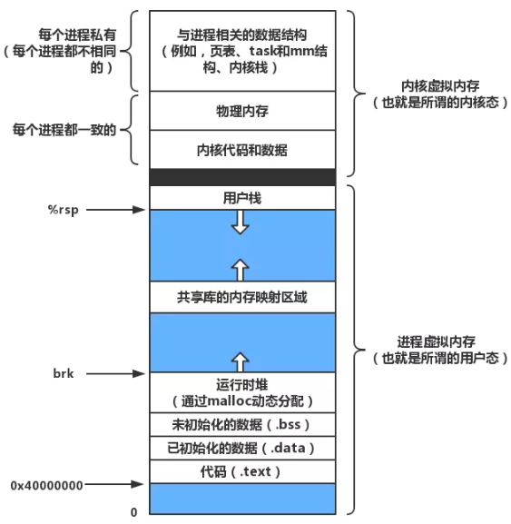

> 最近在处理内存相关的问题，将相关知识总结了下，从 iOS 的角度介绍内存相关知识概念，并列出优化建议和参考工具，希望能对读者有帮助。

## 操作系统内存相关概念

### 起源

1945 年，冯·诺伊曼体系结构被提出，奠定了计算机的基础，同时其局限性也限制了计算机的进一步发展，直至现代，计算机体系还是没能逃离其局限性，只是陆续对其组织结构进行优化而已。

冯·诺伊曼体系结将计算机分为运算器、控制器、存储器、输入设备和输出设备五大部分，由于存储器的读写效率远远低于运算器（CPU）工作效率，导致了 CPU 性能的浪费，而随着摩尔定律，CPU 发展越来越快，这种差距会越来越明显。

> 摩尔定律：当价格不变时，集成电路上可容纳的元器件的数目，约每隔18-24个月便会增加一倍，性能也将提升一倍。


### 多级缓存

对于冯·诺伊曼体系结构局限性，目前通用计算机一般会设置多级缓存，从 CPU 缓存到磁盘，读写速度逐级递减，类似金字塔结构，塔尖负责缓存高频使用的数据，对稳定性和读写效率有更高要求，而底部用于存储常规数据，需要容量足够大，以供上层结构调用，同时兼顾性价比。


以 intel i7 为例，其存储器的层次结构如上图，能看到用到的存储器有SRAM、DRAM、本地磁盘等。

存储器分为：

- 易失性存储器

  特点是读写速度快，断电数据会丢失，价格贵，容量小；主要代表是随机访问存储器（RAM），**RAM 又分为 SRAM（静态）和 DRAM（动态）**，静态价格更贵速度也更快，从上图可以看到 L1~L3 使用的是SRAM，L4 主存用的 DRAM，通常情况下，SRAM 都会集成中 CPU 芯片中。

- 非易失性存储器

  特点是读写速度较慢，但断电数据会保存，价格贵，容量大；**分为只读存储器（ROM）和闪存（Flash memory）两类**，计算机用的机械硬盘就是 ROM 的一种，而闪存常用于手机中。

### 局部性原理

由于实际数据和指令是保存在本地磁盘中的，无论加多少级缓存也改变不了磁盘的读写速度，所以加缓存的实际目的在于利用程序设计的 **局部性原理** 来提高操作效率。

局部性原理（Principle of locality），即程序倾向于引用临近于与其他最近引用过的数据项的数据项，或者最近引用过的数据项本身，所以当我们访问某个数据项时，把它包括周边的数据项放在高速缓存中，那么就有较大概率节约下次访问存储器的时间。

### 物理内存&虚拟内存

- 物理内存：在进程运行时，为操作系统及进程提供临时存储空间，需要借助物理存储器进行存储。目前最新的 iPhone 11 内存为 4GB。

- 虚拟内存：Virtual Memory，是计算机内存管理的技术之一，为每个进程提供一个**连续并私有的地址空间**，从而保护每个进程的地址空间不被其它进程损坏，降低了开发的复杂度，开发者只需要关注自身进程即可，如下图所示。（iOS分别在 32 / 64 位操作系统下，给每个进程提供了 4 / 16 GB  的虚拟内存）

  

  有了虚拟内存后，进程访问的是分配给它的虚拟内存，而虚拟内存实际可能映射到物理内存以及硬盘的任何区域，这样就方便了系统使用共享库，并且当内存空间不足时，还可以将部分不使用的内存数据交换到硬盘中或者进行压缩。

### 内存分页

为了方便虚拟内存和物理内存的映射及管理，目前大部分计算机的内存都采用了分页管理，将虚拟内存和物理内存分别分割成 大小相同的单位。iOS下每个进程空间先分段，每个段内再分页，所以物理地址由 `段号 + 段内页号 + 页内地址` 组成，目前 64 为系统每页为 16KB。

内存分页的最大意义在于支持了物理内存的离散使用，连续的虚拟内存页实际映射的物理内存页可以是任意存放的，方便了操作系统对物理内存的管理，也能最大化利用物理内存，减少内存空间的浪费。

### 虚拟寻址

最早之前，CPU 都是物理寻址的方式通过物理地址直接访问内存，有了虚拟内存的概念后，也就有了虚拟寻址的方式。


CPU 访问虚拟地址，经过 **MMU（Memory Management Unit）**翻译成物理地址访问内存，虽然效率相对于物理寻址有所下降，但如之前所说，CPU 的效率是远远高于其对内存的读写，所以影响不大。

另外 MMU 中有一个 **TLB（Translation Lookaside BUFFER）**来缓存翻译过物理地址的虚拟地址，每次访问时会先在 TLB 查找，没有命中则在**页表（Page Table）**中继续查询；如果 TLB 和 页面没有命中，则说明要访问的地址不在内存中，即**缺页（Page Fault）**，此时会从磁盘中查找，如果命中则将其加载到内存里，并写入页表；如果上述都找不到，则内存访问异常。

### 缺页处理（Page Fault Handler）

当产生缺页时，会交由 Page Fault Handler，根据缺页类型做不同处理。

- Hard Page Fault

  表示物理内存中没有对应的页帧，此时需要 CPU 从磁盘读取到物理内存中，再通过 MMU 建立虚拟地址和物理地址的映射关系。

- Soft Page Fault

  表示物理内存中存在页帧，但可能是其他进程读取到共享库中，当前进程不知道，只需要 MMU 建立映射到共享内存区域。

- Invalid Page Fault

  无效缺页错误，会触发 SIGSEGV 信号导致结束进程，常出现在非法操作导致的访问越界。

### 内存交换机制（Swap In/Out ）

通常磁盘中都会有一个区域作为内存交换空间（Swap Space），内存管理单元（MMU）会将内存中暂时不用的内容写到交换空间中，该过程即为 Swap Out；当需要使用访问时，在从内存交换空间中读取，即 Swap In；这两种操作都是比较耗时的，频繁使用对性能影响较大，通常在物理内存不足以供程序使用时，操作系统会自动进行 Swap 操作。

iOS 不支持该机制，由于手机使用的都是闪存，频繁读写对其影响较大，并且闪存的空间也较小，目前最高配置为 512 GB，跟电脑相比还是有不小差距，因此 iOS 采用的是内存压缩机制（Compressed memoryy），后面会具体介绍。

## iOS内存机制

### 内存空间

同其他系统一样，iOS 也使用了虚拟内存机制，前面介绍过，内存是采用分段和分页管理的，在 iOS 系统下，内存从`高地址到低地址` 分为：

- 栈区（stack）：用于存储程序临时创建的局部变量和函数参数等，在作用域执行完毕后会被系统回收，其中分配的地址由高到低分布。
- 堆区（heap）：用于存储程序运行中动态分配的内存段（通过调用 alloc 等函数），例如创建的新对象，默认由 ARC 进行管理，MRC 模式下需要手动进行内存释放，其中分配的地址由低到高分布。
- 全局静态区：由编译器分配，主要是存放全局变量 和 静态变量，程序结束后由系统释放；主要分为：
  - BBS区：存放**未初始化**的全局变量 和 静态变量。
  - 数据区：存放**已初始化**的全局变量 和 静态变量。
- 常量区：存放的是常量，如常量字符串，程序结束后由系统释放。
- 代码区：由于存放程序代码。


### 内存大小

目前最新的 iPhone 11 Pro Max 的 RAM 才只有 4GB，而安卓的低端机型 4GB 随处可见。虽然内存有限，但 iOS 系统为每个进程提供了非常大的虚拟内存空间，32 位的进程有高达 4GB 的可寻址空间，而 64 位的进程更是有256TB（2^48）的可寻址空间，对于正常程序开发绰绰有余（为什么不是 2 ^ 64 ? 因为 2^48 已经非常大了，理论上市用不完的，再扩大的可寻址空间只是资源浪费）。

### 内存压缩机制

当物理内存不够用时，iOS 会按照 **LRU（Least Recently Used）**最近最少使用原则，将部分物理内存的内容压缩，在需要读写时再解压，从而达到节约内存的效果。

在其他操作系统下（非 iOS），还可以用压缩的内存进行内存和磁盘数据交换，提升交换效率。将交换后的压缩内容放在内存里，发生 page fault 时再解压缩出来，那么从时间上，将只有CPU的压缩和解压缩的开销，而没有耗时多的 I/O 传输的开销。当然代价就是，从空间上，需要占用一部分的内存资源。

### 内存类型

iOS 的内存分为 **Clean Memory** 和 **Dirty Memory** 两种类型，其中上面提到的压缩得到的 Compressed Memory 也属于 Dirty 类型；对于开发者，通常只需要 Dirty Memory 即可。

通常情况下，我们申请内存空间后得到的都是 Clean 类型，只要在写入数据后才会变成 Dirty，例如下面代码，只有在第一页和最后一页会产生 Dirty Memory：

```objective-c
int *array = malloc(20000 * sizeof(int)); 
array[0] = 32                           
array[19999] = 64                         
```

### VM Region

为了更好的管理内存，系统将一组连续的内存页定义为一个 VM Region，每个 VM Region 都包含了 **Dirty 页数**、**Compressed 页数**和**已映射到虚拟内存页的列表**等信息。

```objective-c
struct vm_region_submap_info_64 {
	vm_prot_t		protection;     /* present access protection */
	vm_prot_t		max_protection; /* max avail through vm_prot */
	vm_inherit_t		inheritance;/* behavior of map/obj on fork */
	memory_object_offset_t	offset;		/* offset into object/map */
  unsigned int            user_tag;	/* user tag on map entry */
  unsigned int            pages_resident;	//  已经被映射到物理内存的虚拟内存页列表
  unsigned int            pages_shared_now_private; /* only for objects */
  unsigned int            pages_swapped_out; /* only for objects */
  unsigned int            pages_dirtied;   /* only for objects */
  unsigned int            ref_count;	 /* obj/map mappers, etc */
  unsigned short          shadow_depth; 	/* only for obj */
  unsigned char           external_pager;  /* only for obj */
  unsigned char           share_mode;	/* see enumeration */
	boolean_t		is_submap;	/* submap vs obj */
	vm_behavior_t		behavior;	/* access behavior hint */
	vm_offset_t		object_id;	/* obj/map name, not a handle */
	unsigned short		user_wired_count; 
};

```


### 内存警告

当系统内存不够用时，会向当前进程发送内存警告，开发者通过接受内存警告，主动进行处理，以防止进程崩溃。

接受内存警告的三种方式：

- **UIApplicationDelegate**的`applicationDidReceiveMemoryWarning:`
- **UIViewController**的`didReceiveMemoryWarning`
- **NSNotificationCenter**的`UIApplicationDidReceiveMemoryWarningNotification`

通常情况下，清理无用内存来减小当前进程的内存占用是正确的做法，但是由于存在 Compressed Memory，使得实际处理起来有些复杂。


如上图所示，当我们接受到内存警告时，准备将 Dictionary 中的部分内容释放掉，但由于之前 Dictionary 长时间未使用，被系统自动压缩了，所以需要先将其解压后再释放内容，此时占用的物理内存反而比清理前更大了，甚至可能在解压时达到内存临界点，产生 OOM，进程被杀死。

### Jetsam 机制和 OOM

MacOS / iOS是一个从 BSD 衍生而来的系统，内核是 XNU，XNU 的微内核是 Mach，其处理内存警告和异常使用的是 Jetsam 机制。

 Jetsam 机制下，系统从内核中开启了最高优先级的线程，来监控整个系统的内存情况。当系统内存不足时，会自动发出内存警告或触发 OOM 杀死低优先级的进程，腾出内存供其他高优先级进程使用。

我们可以通过 [XNU 代码](https://opensource.apple.com/tarballs/xnu/) 看到 Jetsam 的处理机制，其中内存状态管理相关代码主要在 /bsd/kern/kern_memorystatus.h/c 文件中。

OOM 全称是 Out Of Memory，是一种系统管理内存的机制，当内存不够时，会自动将低优先级的进行kill，腾出内存供其他高优先级进程使用。xnu 本身代码是开源的，可在苹果官方[下载](https://opensource.apple.com/tarballs/xnu/)，其中内存状态管理相关代码主要在 `/bsd/kern/kern_memorystatus.h/c` 文件中。

```c
#define JETSAM_PRIORITY_REVISION                  2

#define JETSAM_PRIORITY_IDLE_HEAD                -2
/* The value -1 is an alias to JETSAM_PRIORITY_DEFAULT */
#define JETSAM_PRIORITY_IDLE                      0
#define JETSAM_PRIORITY_IDLE_DEFERRED             1 /* Keeping this around till all xnu_quick_tests can be moved away from it.*/
#define JETSAM_PRIORITY_AGING_BAND1               JETSAM_PRIORITY_IDLE_DEFERRED
#define JETSAM_PRIORITY_BACKGROUND_OPPORTUNISTIC  2
#define JETSAM_PRIORITY_AGING_BAND2               JETSAM_PRIORITY_BACKGROUND_OPPORTUNISTIC
#define JETSAM_PRIORITY_BACKGROUND                3
#define JETSAM_PRIORITY_ELEVATED_INACTIVE         JETSAM_PRIORITY_BACKGROUND
#define JETSAM_PRIORITY_MAIL                      4
#define JETSAM_PRIORITY_PHONE                     5
#define JETSAM_PRIORITY_UI_SUPPORT                8
#define JETSAM_PRIORITY_FOREGROUND_SUPPORT        9
#define JETSAM_PRIORITY_FOREGROUND               10
#define JETSAM_PRIORITY_AUDIO_AND_ACCESSORY      12
#define JETSAM_PRIORITY_CONDUCTOR                13
#define JETSAM_PRIORITY_DRIVER_APPLE             15
#define JETSAM_PRIORITY_HOME                     16
#define JETSAM_PRIORITY_EXECUTIVE                17
#define JETSAM_PRIORITY_IMPORTANT                18
#define JETSAM_PRIORITY_CRITICAL                 19

#define JETSAM_PRIORITY_MAX                      21

/* TODO - tune. This should probably be lower priority */
#define JETSAM_PRIORITY_DEFAULT                  18
#define JETSAM_PRIORITY_TELEPHONY                19


...
  
typedef struct memstat_bucket {
	TAILQ_HEAD(, proc) list;
	int count;
	int relaunch_high_count;
} memstat_bucket_t;
```

系统定义了多个优先级，每个优先级对应一个 `memstat_bucket_t` 结构体，存放这个优先级下所有进程。可以看到后台应用程序优先级`JETSAM_PRIORITY_BACKGROUND`是3，低于前台应用程序优先级`JETSAM_PRIORITY_FOREGROUND`10，所以当系统内存紧张时，前台进程之前的优先级全被 kill 后（包括后台进程），仍然不满足高优先级进程的内存需求，才会主动 kill 前台进程。

这里要说明下，内存警告和 OOM 没有必然相关性。当瞬间申请了大量内存，而 CPU 正在执行其他任务，会导致进程没有收到内存警告就发生了 OOM；当进程收到内存警告时，如果该进程优先级较高，且系统通过杀死低优先级进程已释放了足够内存，就不会在接收到 OOM。

关于 Jetsam 详细处理流程后面会专门写一篇介绍。

### iOS 对象内存管理机制（MRC & ARC）

iOS 的对象内存管理遵循 `谁创建，谁释放，谁引用，谁管理` 原则，方式分为 MRC 和 ARC。MRC模式下，开发者需手动管理对象引用计数（retain 和 release 等函数），13年发布 ARC 后逐渐取代MRC，除了部分C/C++ 的内存分配和 Core Graphics 等对象，大部分的内存申请、释放等操作都用系统自行完成，开发者只需要避免产生循环引用即可。

### 引用计数

要理解 iOS 的内存管理机制，我们要先知道什么是引用计数（retainCount）。引用计数是用来管理对象生命周期的一种简单有效的方式，当我们创建一个对象时，它的引用计数为 1，当有新的指针指向这个对象时，引用计数就加 1；当某个指针不再指向这个对象时，引用计数减 1；当对象的引用计数为 0 时，说明这个对象没有指针指向，系统会将对象销毁，回收内存空间。

特别说明下，当对象被销毁时，此时去获取该对象的引用计数值为 1。这是因为当最后的指针不指向该对象时（release 操作），系统知道即将回收对象，对象所在内存区域的数据变得没有意义，就没有必要再将引用计数值减 1，减少一次内存写入操作。


## iOS常见内存问题及优化

### 内存泄漏

- ARC 模式下，开发者不再需要手动释放内存，所有内存泄漏基本都是由于对象循环引用引起的。可通过申明弱引用 `weak` 或 `unowned` 来避免循环使用。

- 区别在于 weak 是弱引用，被引用对象释放时候，引用值会自动置为 nil；unowned 是无主引用，需保证被引用对象的生命周期大于等于当前引用者，如果被引用对象提前释放，会导致崩溃。相比 unowned，weak 更加安全，但效率会低一些，类似于可选类型，使用时还需要考虑解包操作，我们还是要根据对象之间的关系来选择合适的处理。

  

- 另外如果相互之间没有持有关系，Block 中是不需要特别处理引用关系，毕竟多余的处理对性能还是有影响。例如调用含有 Block 传参的 static functions，此时当前对象并不持有 static functions，所以不会产生循环引用。

  ```
  class APIClass {
      // static 函数
      static func getData(params: String, completion:@escaping (String) -> Void) {
       // Do Something
      }
  }
  class viewController {
      
      var params = "something"
      var value = ""
      
     func viewDidLoad() {
      
          APIClass.getData(params: self.params) { (value) in
              self.value = value
          }
      }
  }
  ```

  

### WKWebView 白屏问题

- UIWebView 会因为内存使用过大而崩溃，WKWebView 苹果进行了优化，不会 Crash 但会导致白屏，不显示内容。

- 解决方法是监听到 URL 为 nil  或者接收到 WKNavigationDelegate 的 `webViewWebContentProcessDidTerminate` 时，reload 页面。

### 野指针

- 目前最为常见的野指针是 `objc_msgSend` 和 `unrecognized selector sent to`，只要能记录崩溃时的调用栈，一般都较容易解决。

- 开发阶段可以通过开启编译里的 `Zombie Objects` 复现问题，原理是 Hook 系统的 dealloc 方法，执行 __dealloc_zombie 将对象进行僵尸化，如果当前对象再次收到消息，则终止程序并打印出调用信息。

### 图片内存

- 图片读取

  imageNamed 会被缓存到内存中，适用于频繁使用的小图片；imageWithContentOfFile 适用于大图片，持有者生命周期结束后既被释放。

- 图片格式
  
  - iOS 默认创建的图片格式是 SRGB，每个像素点通常包括红、绿、蓝和 alpha 数据4个字节。而实际使用时，图像可能不需要这么多通道。
  - 使用 UIGraphicsBeginImageContextWithOptions 创建的格式固定是 SRGB，可以使用 UIGraphicsImageRenderer （iOS10之后）替代，会自动选择最合适的图像格式。
  
- 缩放图像
  - 将大图片加载到小空间时， UIImage （UIImage.contentsOfFile）需要先解压整个图像再渲染，会产生内存峰值，用 ImageIO框架 替代 UIImage 可避免图像峰值，ImageIO框架（CGImageSourceCreateWithURL）可以直接指定加载到内存的图像尺寸和信息，省去了解压缩的过程。
  
- 后台优化
  - 当应用切入后台时，图像默认还在内存中 ，可以在退到后台或view消失时从内存中移除图片，进入前台或view出现时再加载图片 （通过监听系统通知) 。
  
- HEIC 格式

  - HEIC 是苹果推出的专门用于其系统的图片格式，iOS 11以上支持。
  - 据测试，相同画质比 JPEG 节省 50% 内存，且支持保存辅助图片（深度图、视差图等）。

### OOM 监控

- 指 App 在前台因消耗内存过大导致被系统杀死，针对这类问题，我们需要记录发生 FOOM 时的调用栈、内存占用等信息，从而具体分析解决内存占用大的问题。

- 流程是监控 App 生命周期内的内存增减，在收到内存警告时，记录内存信息，获取当前所有对象信息和内存占用值，并在合适的时机上传到服务器。目前比较出名的 OOM 监控框架有 Facebook 的 [FBAllocationTracker](https://github.com/facebookarchive/FBAllocationTracker) ，国内的有腾讯开源的**[ OOMDetector](https://github.com/Tencent/OOMDetector)**。

  - FBAllocationTracker

    原理是 hook 了 `malloc/free` 等方法，以此在运行时记录所有实例的分配信息，从而发现一些实例的内存异常情况，有点类似于在 app 内运行、性能更好的 Allocation。但是这个库只能监控 Objective-C 对象，所以局限性非常大，同时因为没办法拿到对象的堆栈信息，所以更难定位 OOM 的具体原因。

  - OOMDetector

    通过  `malloc/free` 的更底层接口 `malloc_logger_t` 记录当前存活对象的内存分配信息，同时也根据系统的 `backtrace_symbols` 回溯了堆栈信息。之后再根据伸展树（Splay Tree）等做数据存储分析，具体方式参看这篇文章：[iOS微信内存监控](https://wetest.qq.com/lab/view/367.html)。

### 其它问题

- namo_free Crash

  苹果对于小于 256B 的空间分配使用的是 nano zone，由于内部的问题在  iOS10.0 ~ 10.1 会崩溃，解决方法是创建自己的 zone 替代 nano zone，iOS10.2 之后已修复，对该问题有兴趣的可参考 [聊聊苹果的Bug - iOS 10 nano_free Crash](https://cloud.tencent.com/developer/article/1031006)。

### 其它优化

- 构建缓存时使用 NSCache 替代 NSMutableDictionary

  NSCache 是线程安全的，当内存不足时会自动释放内存（取数据时需要先判空），并且可以通过 `countLimit` 和 `totalCostLimit` 属性设置上限，另外对存在 Compressed Memory 情况下的内存警告也做了优化，这些都是 NSDictionary 不具备的。
  
- 不要将序列化的数据文件当作数据库使用‘

  - Plists、XML、JSON等文件修改都必须替换整个文件，拓展性差，且开销大，容易误用
  - NSUserDefaults默认是Plist


## iOS 内存分析工具

> 大部分内容来自 [iOS Memory 内存详解](https://mp.weixin.qq.com/s/YpJa3LeTFz9UFOUcs5Bitg)

- Xcode memory gauge：在 Xcode 的 Debug navigator 中，可以粗略查看内存占用的情况。

- Instrument - Allocations：可以查看虚拟内存占用、堆信息、对象信息、调用栈信息，VM Regions 信息等。可以利用这个工具分析内存，并针对地进行优化。

- Instrument - Leaks：用于检测内存泄漏。

- MLeaksFinder：通过判断 `UIViewController` 被销毁后其子 `view` 是否也都被销毁，可以在不入侵代码的情况下检测内存泄漏。

- Instrument - VM Tracker：可以查看内存占用信息，查看各类型内存的占用情况，比如 dirty memory 的大小等等，可以辅助分析内存过大、内存泄漏等原因。

- Instrument - Virtual Memory Trace：有内存分页的具体信息，具体可以参考 WWDC 2016 - Syetem Trace in Depth。

- Memory Resource Exceptions：从 Xcode 10 开始，内存占用过大时，调试器能捕获到 `EXC_RESOURCE RESOURCE_TYPE_MEMORY` 异常，并断点在触发异常抛出的地方。

- Xcode Memory Debugger：Xcode 中可以直接查看所有对象间的相互依赖关系，可以非常方便的查找循环引用的问题。同时，还可以将这些信息导出为 memgraph 文件。

- memgraph + 命令行指令：结合上一步输出的 memgraph 文件，可以通过一些指令来分析内存情况。`vmmap` 可以打印出进程信息，以及 VMRegions 的信息等，结合 `grep` 可以查看指定 VMRegion 的信息。`leaks` 可追踪堆中的对象，从而查看内存泄漏、堆栈信息等。`heap` 会打印出堆中所有信息，方便追踪内存占用较大的对象。`malloc_history` 可以查看 `heap` 指令得到的对象的堆栈信息，从而方便地发现问题。总结：`malloc_history` ===> Creation；`leaks` ===> Reference；`heap` & `vmmap` ===> Size。

- MetricsKit： iOS 13 新推出的监控框架，用于收集和处理电池和性能指标，包含下面三部分

  - XCTest Metrics （开发阶段）

    `-(void)measureWithMetrics:(NSArray<id<XCTMetric>> *)metrics 
        block:(void (^)(void))block;` ，通过编写单元测试案例获取对应单元的性能数据。

  - MetricsKit （Beta 或 Release 阶段）

    通过 ` [MXMetricManager.sharedManager addSubscriber:self]` 订阅通知，`- (void)didReceiveMetricPayloads:(NSArray<MXMetricPayload *> *)payloads ` 接受通知处理回调。当 App 累计运行 24 小时候后就会进行回调，回调内容包括内存情况、CPU/GPU 占用，读写磁盘数据量等数据。

  - Xcode Metrics Organize （Release 阶段）

    iOS 13 后，当用户使用 App 时候，iOS 会记录各项指标，然后发送到苹果服务端上，并自动生成相关的可视化报告。通过 Window -> Organizer -> Metrics 可查，包括电池、启动时间、卡顿情况、内存情况、磁盘读写五部分。

### 系列文章

- [深入探索 iOS 安装包体积优化](https://juejin.im/post/6844904169938092045)

- [深入探索 iOS 启动速度优化](https://juejin.im/post/6844904127068110862)

- [深入探索 iOS 启动速度优化（二进制重排）](https://juejin.im/post/6844904121896534024)

- [深入探索 iOS 卡顿优化](https://juejin.im/post/6844904004053368846)

  

### 参考资料

- [iOS内存二三事](https://juejin.im/post/5e8ee75df265da47e7526b67#heading-15)
- [iOS Memory 内存详解](https://mp.weixin.qq.com/s/YpJa3LeTFz9UFOUcs5Bitg)
- [什么是内存（一）：存储器层次结构](https://www.cnblogs.com/yaoxiaowen/p/7805661.html)
- [iOS内存管理的那些事儿-原理及实现](https://juejin.im/post/6844903731457163271)

- [WWDC2018 - iOS Memory Deep Dive ](https://developer.apple.com/videos/play/wwdc2018/416/)
- [Improving Your App's Performance](https://developer.apple.com/documentation/xcode/improving_your_app_s_performance?language=objc)
- [Improving Battery Life and Performance](https://developer.apple.com/videos/play/wwdc2019/417/)

