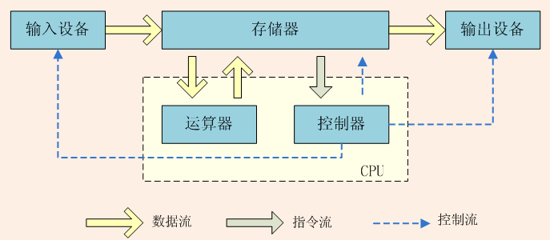

## 内存相关

1. 什么是冯·诺依曼结构？

   

2. 什么是冯·诺依曼结构的瓶颈，以及如何突破瓶颈？

   CPU与存储器的读写效率远低于CPU的工作效率，造成CPU性能浪费；采用多级存储来平衡存储器的速率、容量和价格

3. 存储器分哪两类，分别有什么特点？

   分为易失性存储区（断电丢失数据）（例如RAM）和非易失性存储器容（例如ROM）；RAM分为SRAM和DRAM，SRAM容量更小但速度更快，作为高速缓存，DRAM作为主存；ROM最开始是只读，后面也发展成可读写，作为固件使用

4. 为什么使用多级缓存能提高效率？

   存在局部性原理-被使用过的存储内容和附近内容未来可能会被多次使用，因此将其放在高速缓存中，那么下次再读取该部分内容时效率就会更高

5. 什么是物理寻址？什么是虚拟寻址？

   物理寻址：CPU直接通过地址去访问内存

   虚拟寻找：CPU通过访问虚拟地址，经过CPU中的内存管理单元（MMU）翻译后得到真实物理地址，才去访问内存

6. 虚拟地址翻译过程由谁负责？具体流程是怎样的？

   首先会在 TLB（Translation Lookaside Buffer）中进行查询，它表位于 CPU 内部，查询速度最快；如果没有命中，那么接下来会在页表（Page Table）中进行查询，页表位于物理内存中，所以查询速度较慢；最后如果发现目标页并不在物理内存中，称为缺页，此时会去磁盘中找。当然，如果页表中还找不到，那就是出错了。

7. 虚拟内存有哪些意义？

   为每个进程提供了独立、私有、连续的空间，方便进行内存管理；保护了进程的地址空间，防止出现越界操作；通过内存交互机制，利用硬盘拓展了内存空间（iOS不支持）

8. 什么是内存交换机制？

   当物理内存空间不够时，将部分内存数据放在硬盘中存储

9. 内存分页有什么意义？

   内存分页最大的意义在于，支持了物理内存的离散使用。由于存在映射过程，所以虚拟内存对应的物理内存可以任意存放，这样就方便了操作系统对物理内存的管理，也能够可以最大化利用物理内存。同时，也可以采用一些页面调度（Paging）算法，利用翻译过程中也存在的局部性原理，将大概率被使用的帧地址加入到 TLB 或者页表之中，提高翻译的效率。

10. iOS 的内存机制有什么特点？

    使用虚拟内存；单应用可用内存大；不支持内存交互；会有内存警告和OOM；

11. clean memory、dirty memory、compressed memory 分别是什么？

    clean memory:  能被重新创建和未使用的内存

    dirty memory：除了clean memory都是

    compressed memory：iOS会将部分物理内存压缩，在被访问到时再解压，以达到节省内存的目的，压缩后的内存即是compressed memory，也属于dirty memory

12. 引起循环引用的本质原因是什么？

    引用计数器没有清0，导致资源空间未被释放

13. weak 和 unowned 的区别是什么？

    weak更安全，可为nil，unowned性能更高，但为nil会崩溃，常用语引用的实例有更长的生命周期时

14. 列举一些不会导致循环引用的闭包场景。

    DispatchQueue、static functions（因为不会self持有） 

15. 什么是 OOM 崩溃？

    OOM分为前台和后台，在系统内存告急时，会想每个进程发送内存警告，并根据进程优先级和大小优先杀死低优先中大内存的进程。

16. 检测 OOM 崩溃有哪些常见方法？

    FBAllocationTracker hook malloc/free，记录运行时所有内存的分配释放，从而发现异常情况

    OOMDetector 通过更底层接口 `malloc_logger_t` 记录当前存活对象的内存分配信息，同时也根据系统的 `backtrace_symbols` 回溯了堆栈信息。之后再根据伸展树（Splay Tree）等做数据存储分析

17. OOM 崩溃有哪些常见原因？

    内存泄漏

    UIWebview

    大图片、复杂视图等

